# CC Module Dependency Graph (T0–T7)

> **层级规则：** 依赖方向向下（高层 → 低层）。  
> **关键约束：** T6/T7 不得 `import` T0–T5；T1 不得 `import` T2。

---

## Mermaid 依赖图

```mermaid
graph TD
    T7["T7 · 类型/常量<br/>(types/ · constants/ · entrypoints/)"]
    T6["T6 · 基础工具<br/>(utils/ · native-ts/ · plugins/ · skills/)"]
    T5["T5 · 服务层<br/>(services/ · memdir/)"]
    T4["T4 · Ink基础设施<br/>(ink/ · context/ · keybindings/)"]
    T3["T3 · Hooks层<br/>(hooks/)"]
    T2["T2 · UI层<br/>(components/ · screens/ · buddy/ · vim/)"]
    T1["T1 · 工具层<br/>(tools/)"]
    T0["T0 · 核心运行时<br/>(bootstrap/ · settings/ · query/ · state/ · modes/ · coordinator/)"]

    EXT["外部集成<br/>(bridge/ · cli/ · commands/ · server/)"]

    T0 --> T7
    T0 --> T6
    T0 --> T5
    T0 --> T1
    T1 --> T7
    T1 --> T6
    T1 --> T5
    T2 --> T7
    T2 --> T6
    T2 --> T4
    T2 --> T3
    T2 --> T0
    T3 --> T7
    T3 --> T6
    T3 --> T5
    T3 --> T0
    T4 --> T7
    T4 --> T6
    T5 --> T7
    T5 --> T6
    T6 --> T7
    EXT --> T0
    EXT --> T2
    EXT --> T5
    EXT --> T6
    EXT --> T7

    style T7 fill:#2d5a27,color:#fff
    style T6 fill:#1a4a7a,color:#fff
    style T5 fill:#4a1a7a,color:#fff
    style T4 fill:#7a4a1a,color:#fff
    style T3 fill:#7a1a4a,color:#fff
    style T2 fill:#1a7a4a,color:#fff
    style T1 fill:#7a5a1a,color:#fff
    style T0 fill:#7a1a1a,color:#fff
    style EXT fill:#555,color:#fff
```



---

## 单向约束说明（不能反向依赖）

| 约束 | 说明 |
|------|------|
| `T6 ❌ T0–T5` | 基础工具层是纯函数库，不得引入业务逻辑 |
| `T7 ❌ T0–T6` | 类型层只含类型/常量，零运行时依赖 |
| `T1 ❌ T2` | 工具实现不得依赖 UI 渲染组件 |
| `T1 ❌ T3` | 工具实现不得依赖 React hooks |
| `T5 ❌ T2` | 服务层不得依赖 UI 层 |
| `T5 ❌ T3` | 服务层不得依赖 React hooks |
| `T4 ❌ T0` | Ink 基础设施不依赖应用业务状态 |
| `T4 ❌ T5` | Ink 基础设施不依赖服务层 |

---

## 关键数据流路径

```
用户输入
  └→ T2(PromptInput) → T3(hooks) → T0(query loop)
       ↓
  T0 → T1(tools) → T6(utils/shell/fs)
       ↓
  T1 → T5(services/api) → Anthropic API
       ↓
  T5 → T0 (stream chunks)
       ↓
  T0 → T2(components/messages) → Ink渲染 → 终端输出
```

---

## 特殊说明

### Bridge 层（外部集成）
```
用户(移动/Web)
  └→ bridge/ → T0(REPL会话) → T1/T2/T5（正常流程）
```
Bridge 是双向通道，但对核心运行时是外部调用者，不嵌入 T0–T7 层级。

### 权限系统
```
T0(PermissionManager)
  ├→ T6(utils/permissions/) — 规则匹配/加载
  ├→ T1(tools) — 每次工具调用前检查
  └→ T2(PermissionDialog) — 交互确认 UI
```

### 设置级联
```
T0(settings/loader)
  ├→ CLI flags
  ├→ .qiling/settings.json (project)
  ├→ ~/.qiling/settings.json (global)
  ├→ T5(remoteManagedSettings) — 企业托管
  └→ T6(utils/secureStorage) — API Key存储
```

### MCP 工具链
```
T5(services/mcp/config) — 读取 MCP 服务器配置
  └→ T5(MCPConnectionManager) — 建立连接
       └→ T1(MCPTool) — 每次工具调用
            └→ T6(utils/mcp/elicitationValidation) — 参数校验
```
